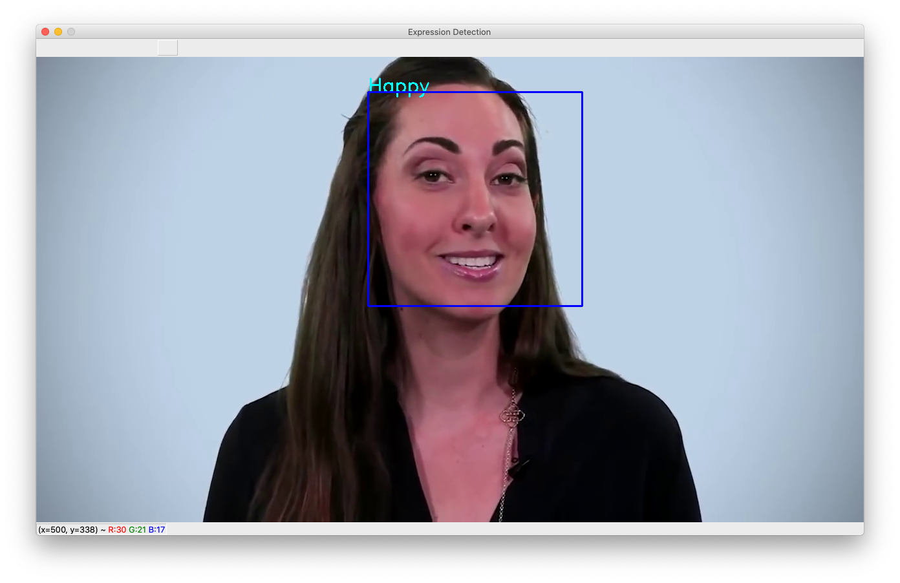

# FER : Facial Expression Recognition [![Version][Version-Badge]][Version] [![License: MIT][License-Badge]](LICENSE.md)

## Info

 - Open Source deep learning framework [TensorFlow](https://tensorflow.com) is used in **Facial Expression Recognition(FER)**.
 - We achieved 75% accuracy of both training and validation on **FER2013** Dataset.

## Dependencies*
**For Script**
 - Python3 (>=3.3)
 - TensorFlow (>=2.0)
 - OpenCV (python3)
 
 **For Training**
 - Python3
 - TensorFlow
 - Numpy
 - Pandas
 - Seaborn
 - Matplotlib
 - Other module used

 *Tested on MacOS

## Usage

 - Install Dependencies using
  
        pip3 install -U pip
        pip3 install -r requirements.txt

 - To run, just type

        python3 main.py
    OR using appropriate permission type

        ./main.py
    using your terminal

 - To quit, press `q`

 - To Train Model

    Open `Model Training` Directory and open the relevant training notebook using Google Colab or your local computer to train model

## Issues & Suggestions
 If any issues and suggestions to me, you can create an [issue](https://github.com/PradyumnaKrishna/FER/issues).

 [License-Badge]:        https://img.shields.io/badge/License-MIT-red.svg
 [Version]:              https://github.com/PradyumnaKrishna/FER/releases/
 [Version-Badge]:        https://img.shields.io/github/v/tag/PradyumnaKrishna/Fer?label=Version
